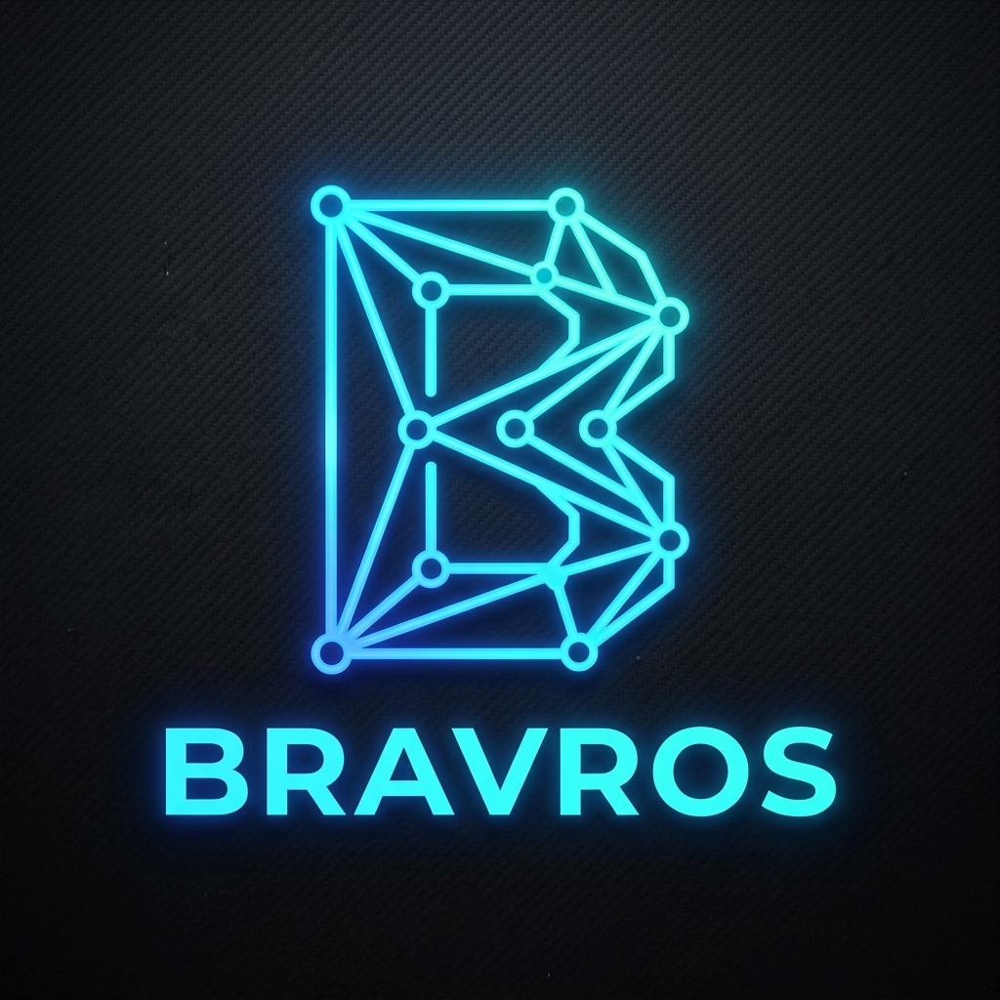

<p align="center">
  
</p>

<h1 align="center">Bravros</h1>

<p align="center">
  <strong>A host-neutral SDLC toolkit for coding agents.</strong><br />
  Free, MIT, no account, no server, no telemetry.
</p>

<p align="center">
  <a href="LICENSE"></a>
  
  
  
  
</p>

---

Coding agents are good at writing code and bad at remembering how *your* team ships it. Bravros
supplies the missing half: a set of **33 workflow skills** that give the agent a repeatable
lifecycle, and a small **Go kernel** for the handful of operations a prompt must never be trusted
to improvise — atomic locks, human-presence gates, and preserve-before-delete.

Skills live in this public repository and reach your machine through each host's own update
mechanism. There is no dashboard, no licence check, and nothing to log into.

---

## ⚡ Install

```bash
curl -fsSL https://install.bravros.dev | sh
```

Or with Homebrew:

```bash
brew install bravros/tap/bravros
```

The installer verifies a minisign signature **before** it places a binary on your system — see
[Verify the trust chain](#-verify-the-trust-chain). Nothing runs unsigned.

Then, once per repository:

```bash
bravros init
```

That detects your stack, writes `.bravros/config.json`, and installs the `commit-msg` and
`pre-push` hooks under `.bravros/hooks/` via `core.hooksPath`. No global state, nothing outside
the repo.

### Getting the skills into your agent

Skills are fetched from this repo, not from the binary — so publishing a skill never requires a
release, and you never run an update command.

| Host | How to add it | Updates |
|---|---|---|
| **Claude Code** | `/plugin marketplace add bravros/bravros` then `/plugin install bravros` | Background refresh, automatic |
| **Gemini CLI** | `gemini extensions install https://github.com/bravros/bravros --auto-update` | On launch, automatic |
| **Cursor** | ships `.cursorrules` | `git pull` |
| **Codex / any AGENTS.md host** | ships `AGENTS.md` | `git pull` |

Install only the core plugin, or add category plugins (`bravros-sdlc`, `bravros-design`,
`bravros-deploy`, `bravros-tools`) if you want the long tail. Core stays small on purpose: an
always-on skill list has a context budget, and blowing it silently hides your least-used skills.

---

## 🚀 The loop

```
/recon  ➔  /orchestrate  ➔  /pr  ➔  /finish
```

```bash
/recon the checkout total is wrong for orders with a coupon
```

`/recon` takes a symptom, a screenshot, a stack trace, or a feature idea and produces **one
dossier folder** — `.planning/P-NNNN-<slug>/` — carrying the brief, the constraints that must not
change, the closed decisions, the traps, and phased tasks with per-phase verify commands.

If it's a defect, `/recon` hands the hunt to `/scout`, which queries the code graph, traces the
real execution path, and **certifies** the cause with runtime proof before anything is written
down. No certification, no diagnosis — it reports `UNCERTIFIED` rather than shipping a guess.

```bash
/orchestrate .planning/P-0001-coupon-total/
```

`/orchestrate` executes that folder: it dispatches phases to subagents by complexity marker,
verifies each phase against its own `Verify:` command, and commits as it goes. `/pr` opens the
pull request; `/finish` merges it and records the outcome.

Nothing about the loop is mandatory. `/quick` exists for a two-line fix, and `/backlog` for an
idea you are not ready to act on.

---

## 🧰 What you can do with it

**Ship a change end to end**

| | |
|---|---|
| `/recon` | Turn a bug report, screenshot, or feature idea into a reviewed dossier with phases and acceptance criteria |
| `/scout` | Find the culprit and certify it with runtime proof — never edits code |
| `/orchestrate` | Execute a dossier phase by phase, verifying each one before moving on |
| `/quick` | Small contained fix, no ceremony |
| `/commit` `/ship` `/push` | Formatted commits, enforced by hook rather than hope |
| `/pr` `/pr-review` `/address-pr` `/local-review` | Open, review, and answer review feedback |
| `/finish` `/promote` `/after-merge` | Merge, release to production behind a human gate, and run the post-deploy checklist |

**Keep a repo healthy**

| | |
|---|---|
| `/backlog` | Park ideas with enough structure to judge later |
| `/triage-sweep` | Drain a stale issue and backlog queue, verifying every close against live code |
| `/batch-merge-prs` `/prune-merged` | Land a queue of PRs, then clean up the branches |
| `/doctor-plus` `/verify-install` | Health-check the toolkit and the workspace |
| `/context` | Generate or audit `CLAUDE.md` / `AGENTS.md` from the actual code |
| `/worktree` | Isolated worktrees with real provisioning |

**Understand a codebase**

| | |
|---|---|
| `/graphify-this-project` | Build a queryable knowledge graph of the code, committed and refreshed on merge |
| `/graphify-status` | Report label coverage across every graph on the machine |
| `/interview-me` | Stress-test a plan round by round until nothing is silently assumed |
| `/advise-project-approach` | Stack and architecture advice grounded in real comparables |

Add the category plugins for the rest, or ignore them. `bravros --help` lists the kernel verbs.

---

## 🛠️ Why there is a CLI at all

Most of the toolkit is prose, because a 2026 model sequences work better than a step list does.
The Go binary exists only for the things a prompt genuinely cannot do:

| Category | Verbs | Why it must be code |
|---|---|---|
| **Format & identity** | `commit`, `nextid` | Commit format is enforced by a hook, not a suggestion. IDs are reserved atomically across worktrees. |
| **Human presence** | `promote`, `destructive`, `pr-review` | The session must be **unable** to mint its own authority. Tokens come from a separate terminal you control. |
| **Atomicity** | `merge-lock` | Two sessions must not merge at once. |
| **Preserve before delete** | `discard`, `trash`, `clean-untracked` | Content git has never seen is copied to `.trash/` before anything removes it. |
| **Provisioning** | `worktree`, `branch`, `config`, `init`, `hooks` | Real filesystem and git work. |
| **Distribution** | `install`, `deploy`, `selfupdate`, `doctor` | Installer machinery, headless. |
| **Secrets** | `secrets set`, `secrets sa-token` | Keyring and `op://` resolution — values never touch a prompt. |

If a rule can be enforced by code, it lives in the binary. If it can't, it's stated once as a
hard constraint in a skill and nowhere else.

---

## 🔒 Safety

**The agent cannot authorize its own dangerous actions.** That's the design, not a policy note.

- **Production merges need you.** `main` is protected by branch rules plus a `pre-push` hook that
  refuses `refs/heads/main`. Promotion stops for a token minted in a separate terminal — the
  running session cannot mint it, so "the agent merged to production on its own" has no path.
- **Deletion preserves first.** `discard`, `trash`, and `clean-untracked` copy into `.trash/`
  before removing anything, and are reversible. Permanently destroying content that git has never
  seen requires a single-use token, again minted out of band.
- **Commit hygiene is enforced, not requested.** The `commit-msg` hook rejects malformed subjects
  and strips AI attribution trailers. A skill that says "never do X" without a mechanism behind it
  is labelled as lore, not presented as protection.
- **Secrets stay out of context.** `secrets` and `sa-token` resolve from your keyring or 1Password
  at the point of use; values are never pasted into a prompt or committed.
- **Installers are the highest-risk code path**, so they behave accordingly: settings files are
  merged, never overwritten, and a backup is written before any change.

## 🕵️ Privacy

**Bravros makes no network calls to us, because there is no "us" to call.** There is no server, no
account, no licence check, no dashboard.

- ❌ No analytics, no crash reporting, no usage or command tracking
- ❌ No file paths, file contents, or prompts leave your machine
- ❌ No third-party SDKs in the binary — grep it yourself
- ✅ The only outbound traffic is **git and GitHub**: cloning this repo for skills, and fetching
  release binaries on update. Both are things you can watch.

Verify it the same way you would verify anyone's claim — run the CLI behind mitmproxy, Charles, or
Wireshark and watch the wire.

---

## 🔐 Verify the trust chain

Every release is signed with minisign, and `install.sh` checks the signature before installing.
To verify by hand:

```bash
PUBKEY="RWQqHlahq4RjNnCasO/8yMsgtLGfdHejILKMxxpsulIs1rII6IgMO26G"

curl -LO https://github.com/bravros/bravros/releases/latest/download/checksums.txt
curl -LO https://github.com/bravros/bravros/releases/latest/download/checksums.txt.minisig

minisign -Vm checksums.txt -P "$PUBKEY"
# expected: Signature and comment signature verified
#           Trusted comment: bravros release
```

The same key is published at [bravros.dev/security](https://bravros.dev/security). Because the
source is public, you can also just build it yourself: `cd cli && go build .`

---

## 📦 What's in this repo

| Path | What it is |
|---|---|
| `skills/` | The 33 skills — source of truth. Each is a `SKILL.md` plus `references/` loaded on demand. |
| `cli/` | The Go kernel. |
| `plugins/` | Generated per-category plugin trees. Do not edit — `tools/skillgen` rewrites them. |
| `tools/skillgen` | Generates the per-host always-on files and lints skills for host-specific tokens. |
| `tools/cataloggen` | Builds `docs/catalog/catalog.json` from skill frontmatter. |
| `.claude-plugin/` | Claude Code marketplace + plugin manifests. |
| `gemini-extension.json` | Gemini CLI extension manifest. |
| `AGENTS.md`, `CLAUDE.md`, `GEMINI.md`, `.cursorrules` | Generated per-host contracts. Edit the source, not these. |
| `install.sh`, `.goreleaser.yml` | Signed release and install path. |

Skills are authored **host-neutral**: no harness-specific tool names, no absolute paths. CI fails
the build if one slips in, which is the only reason the same skill runs unchanged on four hosts.

---

## 📜 License

MIT — see [LICENSE](LICENSE). Contributions welcome via issues and pull requests; the skill catalog
is curated, so open an issue before a large addition.
